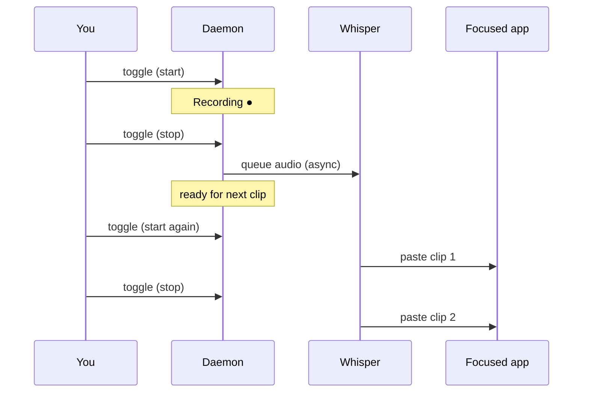

# local-transcription

**Offline push-to-talk dictation for Linux.** Hold a hotkey, speak, release — your words appear at the cursor. No cloud, no subscription, no account. Whisper runs locally on your Intel GPU (or CPU/NPU) via OpenVINO, and text lands in whatever app you're focused on: browser, terminal, editor, chat.

Built for Wayland + Hyprland. Fast enough to feel instant. Private enough to dictate passwords.

---

## Why you'll like it

- **100% offline** — audio never leaves your machine
- **GPU-accelerated** — OpenVINO Whisper on Intel Arc / iGPU / NPU; model loads once, stays resident
- **Push-to-talk workflow** — one key toggles record/stop; text pastes where you're already typing
- **Pipelined sessions** — stop dictating and immediately start the next clip while the previous one is still transcribing; no waiting around
- **Smart paste** — clipboard + `Ctrl+V` by default; `Ctrl+Shift+V` in terminals (Alacritty, kitty, foot, …)
- **Visual feedback** — optional floating indicator: red pulse while recording, orange while transcribing
- **German & English** — auto-detect per clip, or force `de` / `en`

If you've used cloud dictation and hated the lag, the privacy policy, or the "why did it paste that in the wrong window" moments — this is the opposite.

---

## How it works

```
Hyprland keybind  →  CLI (toggle)  →  Unix socket  →  Daemon
                                                        ├─ AudioRecorder (sounddevice)
                                                        ├─ Whisper via OpenVINO (GPU)
                                                        └─ Clipboard paste → focused window
```

1. You run a **daemon** once at login. It loads the Whisper model into memory (~30–60s first start, then instant).
2. Your hotkey sends `local-transcription toggle` over a Unix socket — no model reload per press.
3. **Press once** → microphone records. **Press again** → recording stops, audio is queued for transcription.
4. A background worker transcribes and pastes the text at your cursor. **You can press again right away** to record the next sentence while the last one is still processing.
5. Clips are processed in order, so pasted text always appears in the sequence you spoke.



---

## Quick start

**Requirements:** Linux, Wayland, Python 3.12+, [uv](https://docs.astral.sh/uv/), `wl-copy` + `wtype` (or `ydotool` / `dotool` as fallbacks). Intel GPU recommended; CPU works too.

```bash
git clone https://github.com/saurluca/local-transcription.git
cd local-transcription

# One-time: download OpenVINO Whisper turbo (~1.6 GB)
uv run local-transcription download-model

# Optional: floating recording indicator (needs system GTK libs + PyGObject)
uv sync --extra overlay

# Start the daemon (keep this running)
uv run local-transcription daemon
```

**Hyprland keybind** — add to `hyprland.conf`:

```
bind = SUPER, V, exec, uv run local-transcription toggle
```

Press `SUPER+V` to start recording, press again to stop and transcribe. Keep talking — you don't have to wait for paste to finish before the next clip.

Manual control from a terminal:

```bash
uv run local-transcription toggle   # start / stop
uv run local-transcription status   # IDLE | RECORDING | TRANSCRIBING
uv run local-transcription shutdown
```

---

## Daily usage

| Action | What happens |
|--------|----------------|
| First press | Mic on — speak naturally |
| Second press | Mic off — transcription queued, paste follows shortly |
| Third press (anytime) | Start a new recording, even if the last clip is still transcribing |
| Cursor placement | Text always inserts at the **current** cursor; move it before dictating |

**Spacing between sessions:** with `LT_APPEND_SPACE=1` (default), a leading space is added before the next dictation when you continue from where you left off — handy for flowing prose.

**Languages:** default `auto` detects German or English per recording. Force one language if auto gets it wrong:

```bash
LT_LANGUAGE=de uv run local-transcription daemon
# or: uv run local-transcription daemon --language en
```

Mixed DE+EN in a **single** sentence is a known Whisper limitation; switch languages between clips instead.

---

## Typing & paste behavior

The default **`clipboard`** backend is the reliable choice for browsers, Electron apps (VS Code, Cursor, Slack), and anything that drops keystrokes from character-by-character injection.

1. Snapshot your clipboard (optional restore after paste)
2. Copy transcript via `wl-copy`
3. Send paste chord to the focused window:
   - **`Ctrl+Shift+V`** in terminal window classes (`Alacritty`, `kitty`, `foot`, …)
   - **`Ctrl+V`** everywhere else

Terminal detection uses Hyprland (`hyprctl activewindow`). Check your window class with `hyprctl activewindow -j` and add it to `LT_TERMINAL_CLASSES` if paste fails in a terminal.

Fallback backends: `wtype`, `dotool`, `ydotool` — set via `LT_TYPING_BACKEND`.

---

## Overlay indicator

When enabled (`LT_OVERLAY=1`, default), a small pill appears bottom-center:

| State | Indicator |
|-------|-----------|
| Recording | **Recording ●** — red, pulsing |
| Transcribing (background jobs) | **Transcribing ●** — orange |
| Idle | hidden |

If you're recording a new clip while a previous one transcribes, recording takes visual priority.

Install overlay deps once (example: Manjaro/Arch):

```bash
sudo pacman -S gtk3 gtk-layer-shell gobject-introspection libgirepository cairo pkgconf
uv sync --extra overlay
```

Set `LT_OVERLAY=0` to disable. The daemon works fine without it.

---

## Configuration

| Variable | Default | Description |
|----------|---------|-------------|
| `LT_LANGUAGE` | `auto` | `auto`, `de`, or `en` |
| `LT_DEVICE` | `GPU` | OpenVINO device: `GPU`, `CPU`, `NPU` |
| `LT_HF_MODEL` | `openai/whisper-turbo` | Model for `download-model` |
| `LT_MODEL_DIR` | `~/.local/share/.../whisper-turbo` | Path to converted OpenVINO weights |
| `LT_NUM_BEAMS` | `1` | Beam search width (keep at `1` on Intel Arc GPU) |
| `LT_APPEND_SPACE` | `1` | Leading space before next session after successful dictation |
| `LT_TYPING_BACKEND` | `auto` | `clipboard`, `wtype`, `dotool`, or `ydotool` |
| `LT_PASTE_DELAY_MS` | `120` | Delay before paste shortcut (ms) |
| `LT_CLIPBOARD_RESTORE` | `1` | Restore clipboard after paste (`0` to disable) |
| `LT_TERMINAL_CLASSES` | `Alacritty,kitty,foot,…` | Window classes that get `Ctrl+Shift+V`; empty string = always `Ctrl+V` |
| `LT_OVERLAY` | `1` | Floating recording indicator |
| `LT_OVERLAY_MARGIN` | `32` | Distance from bottom edge (px) |
| `LT_LOG_LEVEL` | `INFO` | Set to `DEBUG` for verbose logs |
| `LT_NOTIFY` | `0` | Desktop notifications via `notify-send |

`LT_STOPPING_WAIT` is legacy and no longer used — pipelined transcription removed the need to wait between sessions.

---

## Models

Pre-converted OpenVINO models from [OpenVINO on Hugging Face](https://huggingface.co/OpenVINO):

| CLI `--model` | OpenVINO repo | Notes |
|---------------|---------------|-------|
| `openai/whisper-turbo` **(default)** | `whisper-large-v3-turbo-fp16-ov` | Best speed/quality tradeoff |
| `openai/whisper-medium` | `whisper-medium-fp16-ov` | Higher accuracy, slower |
| `openai/whisper-small` | `whisper-small-fp16-ov` | Lighter, less VRAM |
| `openai/whisper-tiny` / `base` | … | Fastest, least accurate |

```bash
uv run local-transcription download-model --model openai/whisper-medium
```

---

## Commands

| Command | Description |
|---------|-------------|
| `daemon` | Start the dictation server (loads model once) |
| `toggle` | Start/stop recording |
| `start` / `stop` | Explicit record control |
| `status` | `IDLE`, `RECORDING`, or `TRANSCRIBING` |
| `shutdown` | Stop daemon (finishes pending transcriptions first) |
| `download-model` | Fetch OpenVINO Whisper weights |

---

## Troubleshooting

**Old text appears before new dictation** — Expected when appending at the cursor. Place the cursor where you want new text; previous dictation stays to the left.

**Wrong or garbled text** — Check focus and window; try `LT_LANGUAGE=de` or `en`.

**Nothing pastes / text in wrong place (browsers, Cursor, Electron)** — Use the default `clipboard` backend. Increase `LT_PASTE_DELAY_MS` (e.g. `200`) if focus is slow to settle.

**Nothing pastes in a terminal** — Add your terminal's window class to `LT_TERMINAL_CLASSES`. Run `hyprctl activewindow -j` to find it. Set `LT_LOG_LEVEL=DEBUG` to see which paste chord was sent.

**No recording indicator** — Install GTK + `uv sync --extra overlay`, or set `LT_OVERLAY=0`.

**GPU crash / "Not Implemented"** — Intel Arc doesn't support `num_beams>1` on GPU. Keep `LT_NUM_BEAMS=1`.

**Daemon already running** — `uv run local-transcription shutdown`, or remove stale PID at `$XDG_RUNTIME_DIR/local-transcription.pid`.

---

## Stack

Python 3.12 · [uv](https://docs.astral.sh/uv/) · [OpenVINO GenAI](https://docs.openvino.ai/) · Whisper · sounddevice · Wayland (`wl-copy`, `wtype`) · optional GTK layer-shell overlay

---

*Speak. Stop. Keep speaking. Your GPU handles the rest.*
